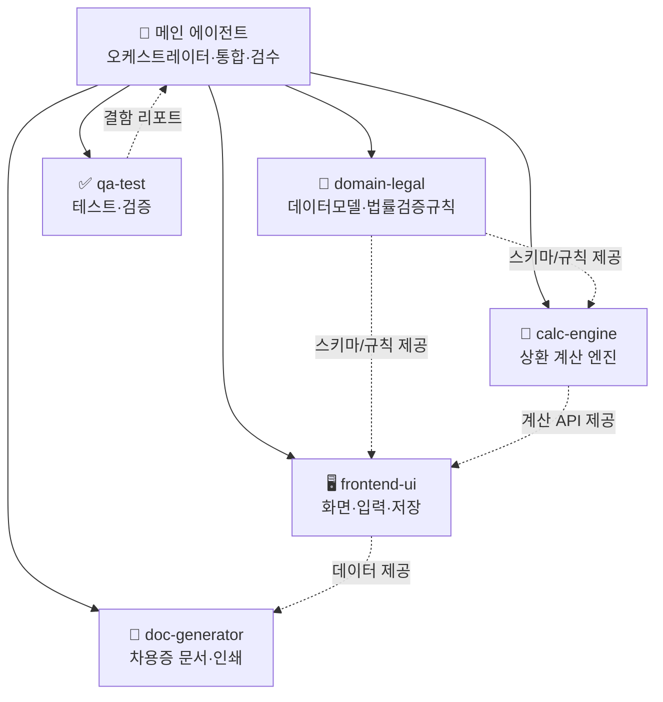

# 차용증(금전소비대차) 관리 앱 — Claude Code 멀티 에이전트 제작 지시서

> **한 줄 요약** — 채권자·채무자·이자·상환조건을 담은 표준 차용증을 작성·출력하고, 실제 상환 내역을 입력하면 **남은 잔액과 앞으로 매월 갚을 금액을 자동으로 갱신**해 주는 로컬 우선(local-first) 웹앱.
>
> - 문서 버전: **v1.1 (최종)** · 작성 기준일: 2026-06-14
> - 대상 실행기: **Claude Code (메인 에이전트 + 서브 에이전트)**
> - 적용 금액 범위: **0원 ~ 100,000,000,000원(1,000억)**
> - 최고이자율 상한: **연 20%** (이자제한법, 강제 검증)
>
> **확정 사양(이 차용증의 실제 값)**: 원금 3,870,000원 · **연 3.5% 단리** · 상환방법 `free`(자유상환) · 이자는 **매월 1개월치**가 잔여원금에 붙고 **상환액은 이자 먼저 충당 후 원금 차감**(첫 상환월 2026-04부터). 범용 앱이므로 다른 값·방식도 모두 지원한다.
>
> **변경 이력**: v1.0 초안 → v1.1 이자율 연 3.5% 확정 반영, 모든 fixture를 검증 코드로 재산출, **검증 완료된 참조 구현(`calc.js`)을 부록 A로 추가**(자체 단위 테스트 8건 통과).

---

## 0. 이 문서 사용법 (메인 에이전트용)

1. 이 문서 전체를 먼저 읽고 `§3`의 빌드 순서(Phase 0~5)에 따라 작업한다.
2. 각 Phase에서 해당 서브 에이전트에게 **해당 섹션 번호와 완료 조건**을 명시해 위임한다.
3. 서브 에이전트의 산출물은 메인 에이전트가 통합·검수하며, **`§9` 테스트와 `§10` 인수 체크리스트를 모두 통과**해야 완료로 본다.
4. 사양 충돌·모호함이 생기면 임의로 확장하지 말고 **사용자에게 닫힌 선택지(2~4개)와 트레이드오프**로 질문한다.
5. 개인정보·금융정보를 다루므로 **서버 전송 금지, 외부 의존성 최소화, 로컬 저장**을 모든 단계에서 지킨다.

---

## 1. 프로젝트 개요와 목표

### 1.1 배경

사용자는 아버지(채권자)와 **387만 원 · 연 3.5% 단리** 차용증을 작성하고 다음과 같이 상환 중이다. (이자 먼저 충당 → 나머지로 원금 차감, 이자는 매월 반올림)

| 시점 | 상환액 | 이자 충당 | 원금 상환 | 잔여 원금 |
|---|---:|---:|---:|---:|
| 2026-04 | 600,000 | 11,288 | 588,712 | 3,281,288 |
| 2026-05 | 200,000 | 9,570 | 190,430 | 3,090,858 |
| 2026-06 | 200,000 | 9,015 | 190,985 | 2,899,873 |
| 2026-07~ | **(앱이 갱신)** | — | — | — |

> 3개월간 납부 이자 합계 29,873원, 원금 상환 합계 970,127원(=상환 총액 1,000,000원). 6월 말 **잔여 원금 2,899,873원.**

매월 실제 상환액이 들쭉날쭉하므로, **그달 상환액을 반영해 “이제부터 매월 얼마씩 갚아야 하는지”를 다시 계산**해 주는 도구가 필요하다. 이런 상황이 앞으로 또 생길 수 있으므로, 특정 금액에 묶이지 않고 **모든 대출금(0~1,000억)과 다양한 상환방식**을 처리하는 범용 앱으로 만든다.

### 1.2 핵심 목표 (3가지)

1. **차용증 작성·출력** — 표준 항목(채권자/채무자/금액/이자/상환일/상환기간/상환방법/지급방법/작성일)을 입력하면 인쇄·PDF 저장 가능한 차용증 문서를 생성한다.
2. **상환 원장 + 자동 갱신** — 실제 상환 내역을 입력하면 남은 잔액을 계산하고, **앞으로의 권장 월 상환액 / 예상 완납일**을 다시 계산해 보여준다. (사용자 핵심 기능)
3. **범용성·정확성** — 0~1,000억 원, 4가지 상환방식, 이자제한법 20% 상한 검증, 한글 금액 표기까지 정확히 처리한다.

### 1.3 비목표 (스코프 제외)

- 회원가입·서버·클라우드 동기화 (로컬 저장 + JSON 내보내기/가져오기로 대체)
- 실제 송금/이체 연동, 전자서명·공인인증
- 다중 사용자 권한 관리
- 세무·법률 “자문” 제공 → 앱은 **정보 안내 + 입력값 검증**까지만 (자세히 `§6`)

---

## 2. 기술 스택 & 전역 제약

### 2.1 권장 스택 (기본값)

**빌드 단계가 없는 정적 웹앱(no-build static web app)** 을 기본으로 한다.

- **HTML + CSS + Vanilla JS (ES Modules)** — 프레임워크/번들러 없음
- 데이터 저장: **`localStorage`** (+ JSON 파일 내보내기/가져오기로 백업·이동)
- 차용증 출력: **브라우저 인쇄 → PDF 저장**(`window.print()` + `@media print` CSS). 별도 PDF 라이브러리는 선택사항.
- 계산 로직: **순수 함수 모듈(`calc.js`)** 로 분리 → Node로 단위 테스트 가능
- 외부 의존성: 원칙적으로 0개. 필요 시 CDN 한 개 이내로 제한하고 문서에 명시.

> **이 스택을 택한 이유**: 설치·빌드 없이 더블클릭(또는 `python -m http.server`)으로 즉시 실행, 휴대폰·PC 어디서나 열림, GitHub Pages 무료 배포 가능, **민감정보가 기기 밖으로 나가지 않음**, 계산 엔진을 순수 함수로 떼어 테스트가 쉬움.

### 2.2 대안 경로 (참고용 — 기본값 대신 선택 시)

| 경로 | 장점 | 트레이드오프(포기하는 것) |
|---|---|---|
| **React + Vite** | 상태관리·컴포넌트 구조화 | 빌드 도구 설치/유지, “간단함” 일부 손해 |
| **Android (Kotlin + Jetpack Compose + Room)** | 네이티브 폰 앱, 포트폴리오 가치 | Android Studio/빌드 환경 필요, 반복 개발 느림, 과한 복잡도 |

> 데이터 모델(`§4`)과 계산 엔진(`§5`)은 스택과 **독립**이므로, 웹앱 v1을 먼저 만든 뒤 동일 로직을 Android로 이식하는 것을 권장 경로로 둔다.

### 2.3 전역 불변식 (모든 에이전트가 지킬 것)

- 금액: **정수 ‘원’ 단위**, `0 ≤ 금액 ≤ 100,000,000,000`. 부동소수점 누적오차 금지 → 원 단위 정수 연산.
- 이율: `0 ≤ 연이율 ≤ 20`(%). 20 초과 입력은 **저장 차단 + 경고**(이자제한법).
- 날짜: `YYYY-MM-DD` (ISO). 타임존 이슈 회피 위해 날짜만 다룬다.
- 개인정보: 서버 전송 금지. 주민등록번호 필드는 **선택 입력 + 화면 마스킹**.
- 접근성: 한글 라벨, 키보드 입력 가능, 모바일 반응형.

---

## 3. 멀티 에이전트 아키텍처

### 3.1 구성도



### 3.2 메인 에이전트 (오케스트레이터)

- **역할**: 빌드 순서 관리, 서브 에이전트 위임, 산출물 통합, 인수 체크리스트 검증, 사용자와의 의사결정 질문.
- **하지 않을 일**: 사양에 없는 기능 임의 추가, 서버/외부 전송 도입, 20% 초과 이율 허용.
- **완료 판단**: `§9` 모든 테스트 통과 + `§10` 체크리스트 전 항목 ✅.

### 3.3 서브 에이전트 (5종)

| # | name | 역할(한 줄) | 핵심 산출물 | 완료 조건 |
|---|---|---|---|---|
| 1 | `domain-legal` | 차용증 도메인 데이터 모델과 법률 검증 규칙 정의 | `model.js`(스키마/타입/검증), `§6` 규칙 반영 | 모든 필드 타입·범위·검증 함수 정의, 20% 상한·한글금액 규칙 포함 |
| 2 | `calc-engine` | 상환 계산(잔액·스케줄·갱신) 순수 함수 구현 | `calc.js` | `§5` 4가지 방식 + 자유상환 갱신 구현, Node 단위테스트 가능 |
| 3 | `frontend-ui` | 입력·원장·대시보드 화면 + 로컬 저장 | `index.html`, `app.js`, `styles.css` | `§7` 4개 화면 동작, localStorage 저장/복원, JSON 내보내기·가져오기 |
| 4 | `doc-generator` | 표준 차용증 문서 렌더링·인쇄·PDF | `agreement-view.js`, 인쇄용 CSS | `§8` 항목 전부 출력, 인쇄 미리보기 정상, 한글 금액 병기 |
| 5 | `qa-test` | 테스트·경계값·사용자 시나리오 검증 | `tests/`(계산 테스트), 수동 QA 체크리스트 | `§9` 케이스 전부 통과, 사용자 387만 원 시나리오 재현 |

### 3.4 빌드 순서 (Phase)

- **Phase 0 — 부트스트랩(메인)**: 디렉터리(`§11`) 생성, `.claude/agents/*` 스텁 작성, README에 목표·제약 명시.
- **Phase 1 — 도메인/규칙(`domain-legal`)**: `model.js`(데이터 모델 + 검증). 다른 에이전트의 의존 기반.
- **Phase 2 — 계산 엔진(`calc-engine`)**: `calc.js`. `§9` 계산 테스트를 먼저 작성(TDD 권장) 후 구현.
- **Phase 3 — UI/저장(`frontend-ui`)**: 화면 4개 + localStorage + 내보내기/가져오기. `calc.js`·`model.js` 연결.
- **Phase 4 — 문서 생성(`doc-generator`)**: 차용증 미리보기·인쇄. UI에 “차용증 출력” 진입점 연결.
- **Phase 5 — 통합 QA(`qa-test` + 메인)**: 전체 테스트, 경계값, 사용자 시나리오, 인수 체크리스트.

### 3.5 핸드오프 규칙

- 산출물은 **파일 경로 + 공개 함수 시그니처(입력/출력 타입)** 를 명시해 넘긴다.
- 인터페이스 변경 시 의존 에이전트에게 변경점을 전달하고 메인이 재검수.
- 계산 결과 불일치 등 결함은 `qa-test`가 **재현 절차 + 기대값/실제값**으로 메인에 보고.

### 3.6 `.claude/agents/` 정의 파일 템플릿 (예시: calc-engine)

```markdown
---
name: calc-engine
description: 차용증 상환 계산 엔진. 잔액 계산, 4가지 상환방식 스케줄, 자유상환 갱신, 한글 금액 변환을 순수 함수로 구현한다. 계산·스케줄·잔액 관련 작업에서 사용.
tools: Read, Write, Edit, Bash
---

너는 금융 상환 계산 전담 엔지니어다. 목표:
- spec의 §5(계산 엔진 명세)를 정확히 구현한다.
- 모든 금액은 정수 '원' 단위로 다루고 부동소수점 누적오차를 피한다.
- 순수 함수로 작성해 Node로 단위 테스트가 가능하게 한다.
- 이율 상한 20% 검증은 domain-legal의 규칙을 호출하거나 동일하게 적용한다.
규칙:
- spec에 없는 기능을 임의로 추가하지 않는다.
- §9 테스트 케이스(특히 사용자 387만 원 시나리오)를 반드시 통과시킨다.
```

> 나머지 4개 에이전트도 같은 형식으로, 각자 담당 섹션 번호·완료 조건·금지사항을 명시해 작성한다.

---

## 4. 데이터 모델

### 4.1 차용증(Agreement) 스키마

| 필드(키) | 의미 | 타입/형식 | 범위·검증 | 비고 |
|---|---|---|---|---|
| `id` | 식별자 | string | UUID/timestamp | |
| `creditor.name` | 채권자(빌려준 사람) 성명 | string | 필수 | |
| `creditor.idNumber` | 채권자 주민번호 | string | **선택**, 마스킹 표시 | 생략 시 생년월일 권장 |
| `creditor.address` | 채권자 주소 | string | 선택 | |
| `creditor.phone` | 채권자 연락처 | string | 선택 | |
| `creditor.account` | 입금받을 계좌 | string | 선택 | 지급방법=계좌이체 시 권장 |
| `debtor.name` | 채무자(빌린 사람) 성명 | string | 필수 | |
| `debtor.idNumber` | 채무자 주민번호 | string | 선택, 마스킹 | |
| `debtor.address` | 채무자 주소 | string | 선택 | |
| `debtor.phone` | 채무자 연락처 | string | 선택 | |
| `principal` | 차용 원금 | integer(원) | `0 ~ 100,000,000,000` | 한글+숫자 병기 표시 |
| `interestRate` | 연이율(%) | number | `0 ~ 20` | 초과 차단(이자제한법) |
| `interestKind` | 이자 계산방식 | enum | `none`/`simple`/`compound` | 기본 `none`(무이자) 또는 `simple` |
| `loanDate` | 차용일(실제 돈 받은 날) | date | 필수 | |
| `contractDate` | 차용증 작성일 | date | 필수 | |
| `maturityDate` | 변제기일(상환 만기) | date | 선택* | 만기일시·자유상환 갱신에 사용 |
| `repaymentPeriodMonths` | 상환기간(개월) | integer | `≥1` | `maturityDate`와 상호 도출 |
| `repaymentMethod` | 상환방법 | enum | `lump`/`equalPrincipal`/`annuity`/`free` | `§5.2` 참조 |
| `paymentMethod` | 지급방법 | enum | `transfer`/`cash` | 기본 `transfer` |
| `lateRate` | 지연손해금율(%) | number | `0 ~ 20` | 선택 |
| `note` | 특약사항 | string | 선택 | |

\* `maturityDate`와 `repaymentPeriodMonths`는 하나를 입력하면 다른 하나를 자동 계산.

**상환방법(enum) 의미**
- `lump` 만기일시상환 — 만기에 원금 일시 상환(이자는 주기적 또는 만기)
- `equalPrincipal` 원금균등분할 — 매월 원금 동일, 이자는 잔액 기준(총 납입액 점감)
- `annuity` 원리금균등분할 — 매월 납입액 동일(원금+이자)
- `free` **자유상환** — 매월 임의 금액 상환(사용자 사례). 갱신 로직(`§5.3`)의 주 대상

### 4.2 상환 원장(Payment) 스키마

| 필드 | 의미 | 타입 | 비고 |
|---|---|---|---|
| `id` | 식별자 | string | |
| `date` | 상환일 | date | 필수 |
| `amount` | 상환액(원) | integer | `>0` |
| `note` | 메모 | string | 선택 |

- 한 차용증(`Agreement`)에 `payments: Payment[]`가 0개 이상 연결된다.

### 4.3 저장 형식

- `localStorage` 키: `loan-app:v1:agreements` → `Agreement[]`(각 항목에 `payments` 포함) JSON 직렬화.
- **내보내기**: 전체 데이터를 `loan-backup-YYYYMMDD.json` 파일로 다운로드.
- **가져오기**: JSON 파일 선택 → 검증 후 복원(스키마 불일치 시 거부).
- 마이그레이션 대비해 최상위에 `schemaVersion` 포함.

---

## 5. 계산 엔진 명세 (`calc.js`)

### 5.1 공통 정의

- 월이율 `r = interestRate / 100 / 12`.
- 모든 중간 계산은 실수로 하되 **사용자 표시·잔액 저장은 원 단위 정수로 반올림**(`Math.round`).
- 상환 회차 개월 수 `n`: `repaymentPeriodMonths` 또는 `loanDate`~`maturityDate` 개월 차.

### 5.2 상환방법별 스케줄 공식

**만기일시상환(`lump`)**
- 단리 총이자 `= principal × (interestRate/100) × (n/12)`
- 매월(선택): 이자만 `principal × r` 납부, 원금은 만기 일시 상환.

**원금균등분할(`equalPrincipal`)**
- 매월 원금 `= round(principal / n)` (마지막 회차에서 잔여 보정)
- k회차 이자 `= round(잔여원금 × r)`, k회차 납입 `= 원금분 + 이자`

**원리금균등분할(`annuity`)**
- `r = 0`이면 월납입 `= round(principal / n)`
- `r > 0`이면 월납입 `= round( principal × r × (1+r)^n / ((1+r)^n − 1) )`
- 회차별로 이자 `= round(잔여원금 × r)`, 원금분 `= 월납입 − 이자`로 분해, 마지막 회차 잔여 보정.

**자유상환(`free`)** → `§5.3`

### 5.3 자유상환 + “갱신” 로직 (사용자 핵심 기능)

목표: 실제 상환 내역을 반영해 **(A) 현재 잔액**, **(B) 앞으로의 권장 월 상환액**, **(C) 예상 완납일**을 다시 계산.

**(A) 현재 잔액 `remainingPrincipal(asOfDate)`**
- 무이자(`interestKind = none`): `잔액 = principal − Σ(asOfDate 이전 상환액)`
- 단리 이자부(`simple`): 상환 시점마다
  1. 직전 상환 이후 발생이자 `accrued = round(잔여원금 × r × 경과개월)`
  2. 이번 상환액으로 **이자 먼저 충당** → 남으면 원금 차감
  3. 잔여원금·미수이자 갱신
- 잔액은 0 미만으로 내려가지 않도록 하한 0 처리(초과 상환은 “과납” 표시).

**(B) 권장 월 상환액 — 두 방향 지원**
- *목표 만기 기준*: `monthsLeft = (시작월 ~ maturityDate) 개월`
  - 무이자: `권장월액 = ceil(remainingPrincipal / monthsLeft)`
  - 이자부: 잔여원금·`monthsLeft`로 `annuity` 공식 재계산
- *계획 월액 기준*: 사용자가 월 상환액을 입력하면 → **예상 완납일/회차** 산출(아래 C).

**(C) 예상 완납일/회차**
- 무이자: `회차 = ceil(remainingPrincipal / 월계획액)`, 완납월 = 시작월 + (회차−1).
- 이자부: 매월 (이자 가산 → 상환액 차감) 시뮬레이션 루프로 잔액이 0이 될 때까지 회차 계산. 월계획액이 월이자보다 작으면 **“상환 불가(원금 미감소)”** 경고.

**사용자 시나리오 적용 예 (연 3.5% 단리)**
- `principal = 3,870,000`, `interestKind = simple`, `interestRate = 3.5`. 상환: 4월 600,000 / 5월 200,000 / 6월 200,000 → 매월 이자(11,288 / 9,570 / 9,015) 먼저 충당 후 원금 차감 → **6월 말 잔여 원금 2,899,873** (납부 이자 합계 29,873)
- 7월부터 목표 만기 2026-12로 설정 시: `monthsLeft = 6(7·8·9·10·11·12)`, 잔여 원금 2,899,873으로 원리금균등 재계산 → **권장 월액 488,258원** (무이자였다면 478,334원이므로 이자분 약 1만 원/월 증가)
- 또는 “월 500,000원” 계획 입력 시: 이자 먼저 차감하며 시뮬레이션 → **6회차(7~12월) 완납**, 마지막 12월 납입액은 429,031원

### 5.4 한글 금액 변환 (참조 구현)

차용증 문서에 `금 ○○○원정` 형태로 병기. 0~1,000억 범위를 정확히 처리해야 한다.

```js
// 0 ~ 100,000,000,000 처리. 십/백/천 앞의 '일'은 생략, 만/억 단위 묶음은 유지.
function numberToKoreanAmount(num) {
  if (!Number.isInteger(num) || num < 0 || num > 100000000000) {
    throw new RangeError("금액 범위 오류(0~100,000,000,000)");
  }
  if (num === 0) return "영원";
  const D = ["", "일", "이", "삼", "사", "오", "육", "칠", "팔", "구"];
  const S = ["", "십", "백", "천"];          // 그룹 내 자리
  const B = ["", "만", "억", "조"];           // 4자리 묶음 단위
  let result = "", gi = 0, n = num;
  while (n > 0) {
    const group = n % 10000;
    if (group > 0) {
      let gs = "", g = group, pos = 0;
      while (g > 0) {
        const d = g % 10;
        if (d > 0) {
          const digit = (d === 1 && pos > 0) ? "" : D[d]; // 십/백/천 앞 '일' 생략
          gs = digit + S[pos] + gs;
        }
        g = Math.floor(g / 10);
        pos++;
      }
      result = gs + B[gi] + result;
    }
    n = Math.floor(n / 10000);
    gi++;
  }
  return result + "원";
}

function formatContractAmount(num) {       // 차용증 표기용
  return "금 " + numberToKoreanAmount(num) + "정";
}
```

기대 동작 예: `10000→일만원`, `100000→십만원`, `1000000→백만원`, `3870000→삼백팔십칠만원`, `100000000000→천억원`.

### 5.5 계산 엔진 공개 API (시그니처 가이드)

```
remainingPrincipal(agreement, asOfDate) -> { principal, accruedInterest, overpaid }
buildSchedule(agreement) -> ScheduleRow[]           // lump/equalPrincipal/annuity
suggestMonthlyByMaturity(agreement, startMonth) -> { monthly, monthsLeft }
projectPayoffByMonthly(agreement, startMonth, monthly) -> { payoffMonth, rounds, warning }
numberToKoreanAmount(num) -> string
```

> **참조 구현 제공**: 위 함수들의 **검증 완료된 구현이 부록 A(`calc.js`)에 통째로 포함**되어 있다. `calc-engine` 에이전트는 부록 A를 시작점으로 사용하고, 날짜→월 변환 래퍼만 앱 레이어에서 연결하면 된다. 부록 A의 단위 테스트(`tests/calc.test.mjs`)는 §9의 모든 기대값을 그대로 검증한다.

---

## 6. 법률·검증 규칙 (정보 안내 — 자문 아님)

> 아래는 **앱이 입력값을 검증하고 사용자에게 정보를 보여주기 위한** 근거다. 앱은 세무·법률 자문을 제공하지 않으며, 실제 판단은 사용자·전문가의 몫이다(면책 `§12`).

### 6.1 이자율 상한 (강제 검증)

- 금전대차 계약상 **최고이자율은 연 20%**. 약정이율이 없으면 민법상 법정이율 연 5%가 적용된다.
- **검증 규칙**: `interestRate > 20`이면 저장 차단 + 경고 메시지. (`lateRate`도 동일하게 20% 상한 적용)

### 6.2 가족 간 차용 안내 (정보 표시)

화면 도움말/툴팁으로 다음을 안내한다(수치는 변동 가능, 작성 기준일 시점):

- 국세청 **적정이자율은 연 4.6%**. 무상·저리 대출의 이익(적정이자−실제이자)이 **연 1,000만 원 이하면 증여세 비과세** → 환산하면 **약 2억 1,700만 원 이하**는 무이자 차용이 가능.
- 단, 한도 내라도 **원금을 실제로 상환**해야 ‘대여’로 인정. 차용증만 쓰고 상환이 없거나 미미하면 형식적 차용으로 보아 증여로 의제될 수 있다.
- 직계존속 증여재산공제: **성인 자녀 5,000만 원**(미성년 2,000만 원), 혼인·출산 시 **1억 원 추가**.
- 작성일 입증: **공증 또는 등기소 확정일자**. 원금·이자는 **계좌이체**로 주고받아 이체내역을 남기는 것이 안전.
- 상환기간이 지나치게 길면(예: 30년) 사실상 증여로 볼 위험. 합리적 기간 설정 권장.

### 6.3 사용자 387만 원 사례 해설 (참고)

- 387만 원은 직계존속 증여공제(5,000만 원)와 무이자 한도(약 2.17억)를 **크게 밑돈다** → 설령 증여로 보더라도 증여세가 발생하지 않는 수준.
- 이 차용증은 **연 3.5% 단리**로 설정한다. 적정이자율 4.6%보다는 낮지만, 그 차이로 보는 이익(약 (4.6%−3.5%)×3,870,000 ≈ 연 4.3만 원)이 1,000만 원에 한참 못 미쳐 **증여로 볼 소지가 없다.** 아버지가 받는 이자(연 약 13.5만 원)는 형식상 이자소득이나, 소액 가족 거래라 실무 부담은 사실상 없다(판단은 전문가 확인).
- 핵심은 **차용증 + 매월 이자·원금을 계좌이체로 주고받은 내역**을 남기는 것. 이것만으로 ‘대여’ 입증에 충분하다.
- 앱은 이 사례를 기본 예시/테스트 데이터로 포함한다(`§9`).

---

## 7. UI / 화면 명세 (`frontend-ui`)

모바일 반응형, 한글 라벨, 큰 터치 영역. 화면 4개 + 공통 내비게이션.

### 화면 ① 차용증 입력/편집
- 섹션: 채권자 / 채무자 / 대출조건 / 상환조건 / 지급방법 / 특약.
- `principal` 입력 시 옆에 **한글 금액 자동 표시**(`금 …원정`).
- `interestRate > 20` 입력 시 즉시 경고·저장 차단.
- `maturityDate` ↔ `repaymentPeriodMonths` 자동 연동.
- 주민번호 입력 칸은 마스킹 토글 제공.

### 화면 ② 상환 원장
- 상환 추가(날짜·금액·메모), 목록(날짜순), 수정/삭제.
- 합계: 총 상환액 / 현재 잔액(`§5.3 A`).

### 화면 ③ 상환 대시보드(갱신 결과)
- **현재 잔액**(원금/미수이자/과납 표시).
- 모드 토글: *목표 만기 기준 권장 월액* ↔ *계획 월액 기준 예상 완납일*.
- 진행률 바(상환/원금), 남은 회차, 예상 완납월.
- `repaymentMethod`가 `annuity`/`equalPrincipal`/`lump`이면 표준 상환 스케줄 표 표시.

### 화면 ④ 차용증 미리보기·출력 → `doc-generator`(`§8`)
- “차용증 출력” 버튼 → 인쇄용 레이아웃 미리보기 → `window.print()`로 PDF 저장.

### 공통
- 데이터 **내보내기/가져오기**(JSON) 버튼.
- 빈 상태 안내, 입력 검증 에러 메시지, 되돌리기 가능한 삭제.

---

## 8. 차용증 문서 양식 (`doc-generator` 생성물)

표준 항목을 모두 포함하고, 금액은 한글+숫자 병기. 인쇄 시 A4 1장 기준 깔끔한 레이아웃.

**필수 출력 항목 체크리스트**
- [ ] 제목: `차 용 증` (또는 `금전소비대차계약서`)
- [ ] 차용금액: `금 ○○○원정 (₩○,○○○,○○○)`
- [ ] 이자: `연 ○%` (무이자면 `무이자` 명시), 이자 지급시기·방법
- [ ] 채권자: 성명 / (주민번호) / 주소 / 연락처 / (입금계좌)
- [ ] 채무자: 성명 / (주민번호) / 주소 / 연락처
- [ ] 차용일(돈 받은 날), 변제기일(만기), 상환기간
- [ ] 상환방법(만기일시/원금균등/원리금균등/자유상환 중 표시)
- [ ] 지급방법(계좌이체/현금) — 계좌이체 시 계좌 명시
- [ ] (선택) 지연손해금율, 기한이익 상실, 특약사항
- [ ] 작성일자
- [ ] 채권자·채무자 서명/날인란

**인쇄 레이아웃 요구**
- `@media print`로 화면 UI(버튼·내비) 숨김, 문서 본문만 출력.
- 금액·날짜·당사자 정보는 입력 데이터에서 자동 채움.
- 한 페이지 넘칠 경우 페이지 나눔 깔끔히 처리.

---

## 9. 테스트 케이스 (필수 — `qa-test`)

### 9.1 사용자 시나리오 fixture (반드시 통과)

```
입력: principal=3,870,000, interestRate=3.5, interestKind=simple, repaymentMethod=free
모델: 자유상환·단리, 매월 이자=round(잔여원금×r) 먼저 충당 후 원금 차감 (r=3.5/100/12)
      첫 상환월(2026-04)부터 매월 1개월치 이자 발생 가정
상환: 2026-04 600,000 / 2026-05 200,000 / 2026-06 200,000

월별 기대값(이자 / 원금 / 잔여원금):
  - 2026-04: 이자 11,288 / 원금 588,712 / 잔여 3,281,288
  - 2026-05: 이자  9,570 / 원금 190,430 / 잔여 3,090,858
  - 2026-06: 이자  9,015 / 원금 190,985 / 잔여 2,899,873

기대:
  - remainingPrincipal(2026-06-30).principal === 2,899,873
  - 3개월 납부이자 합계 === 29,873, 원금상환 합계 === 970,127
  - suggestMonthlyByMaturity(startMonth=2026-07, maturity=2026-12).monthsLeft === 6
  - suggestMonthlyByMaturity(...).monthly === 488,258   // 잔여 2,899,873, 연3.5%, 6개월 원리금균등(올림)
  - projectPayoffByMonthly(startMonth=2026-07, monthly=500,000).rounds === 6
  - projectPayoffByMonthly(...).payoffMonth === "2026-12"
  - projectPayoffByMonthly(...).lastPayment === 429,031   // 마지막(12월) 납입액

참고(무이자였다면): 잔여 2,870,000 / 권장월액 478,334 — 비교용, 본 fixture는 3.5% 기준
```

### 9.2 경계값·기능 테스트

| 케이스 | 입력 | 기대 |
|---|---|---|
| 0원 | principal=0 | 잔액 0, 한글 `영원`, 에러 없음 |
| 상한 금액 | principal=100,000,000,000 | 정상, 한글 `천억원` |
| 상한 초과 금액 | principal=100,000,000,001 | 저장 차단/검증 실패 |
| 이율 상한 | interestRate=20 | 정상 저장 |
| 이율 초과 | interestRate=20.1 | 저장 차단 + 경고 |
| 무이자 자유상환 | none + free | `잔액 = 원금 − Σ상환` |
| 원리금균등(이자0) | annuity, r=0, n=12 | 월납입 = round(principal/12), 마지막 보정 합 = principal |
| 원리금균등(이자>0) | annuity, 예: 1,200만/연6%/12개월 | 월납입 === 1,032,797, 총원금 분해합 === 12,000,000, 총이자 ≈ 393,566 |
| 원금균등 | equalPrincipal | 매월 원금 동일(마지막 보정), 이자 점감 |
| 상환 불가 경고 | 이자부, 월계획액 < 월이자 | `warning` 반환 |
| 과납 | Σ상환 > 원금 | 잔액 0 + 과납 표시 |
| 1개월 만기 | n=1 | 스케줄 1행, 합계 일치 |

### 9.3 한글 금액 변환 테스트
- `0→영원`, `1→일원`, `10→십원`, `15→십오원`, `100→백원`, `10000→일만원`, `100000→십만원`, `1000000→백만원`, `2899873→이백팔십구만구천팔백칠십삼원`, `3870000→삼백팔십칠만원`, `100000000→일억원`, `100000000000→천억원`.

### 9.4 저장/복원
- 입력→`localStorage` 저장→새로고침→복원 동일.
- 내보내기 JSON→가져오기→데이터 동일. 잘못된 스키마 JSON→가져오기 거부.

---

## 10. 빌드 순서 & 인수 체크리스트

**진행 순서**: Phase 0 → 1 → 2 → 3 → 4 → 5 (`§3.4`). Phase 2는 `§9` 계산 테스트 선작성(TDD) 권장.

**인수 체크리스트 (전부 ✅ 시 완료)**
- [ ] 빌드 없이 실행됨(파일 열기 또는 정적 서버), 콘솔 에러 없음
- [ ] 차용증 입력 → 저장 → 새로고침 후 복원
- [ ] 한글 금액 자동 표시(입력 옆), 차용증 문서에 병기
- [ ] 이율 20% 초과 차단, 금액 0~1,000억 검증
- [ ] 상환 추가/수정/삭제, 현재 잔액 정확
- [ ] 자유상환 갱신: 목표만기→권장월액 / 계획월액→완납일 양방향 동작
- [ ] 4가지 상환방식 스케줄 표 정상
- [ ] 차용증 미리보기·인쇄(PDF 저장) 정상, 표준 항목 전부 출력
- [ ] JSON 내보내기/가져오기 동작
- [ ] `§9` 모든 테스트 통과(특히 387만 원 시나리오)
- [ ] 데이터 서버 전송 없음(네트워크 요청 0 또는 명시된 CDN만)
- [ ] 면책 문구 노출(`§12`)

---

## 11. 권장 디렉터리 구조

```
loan-agreement-app/
├─ index.html              # 진입점(SPA)
├─ styles.css              # 화면 + @media print
├─ src/
│  ├─ model.js             # domain-legal: 스키마/타입/검증
│  ├─ calc.js              # calc-engine: 잔액/스케줄/갱신/한글금액
│  ├─ app.js               # frontend-ui: 화면·상태·이벤트
│  ├─ storage.js           # localStorage 저장/복원, JSON 내보내기/가져오기
│  └─ agreement-view.js    # doc-generator: 차용증 문서 렌더링
├─ tests/
│  └─ calc.test.mjs        # §9 계산 테스트(Node 실행)
├─ .claude/
│  └─ agents/
│     ├─ domain-legal.md
│     ├─ calc-engine.md
│     ├─ frontend-ui.md
│     ├─ doc-generator.md
│     └─ qa-test.md
├─ spec.md                 # 이 지시서(또는 링크)
└─ README.md               # 실행법·목표·제약·면책
```

테스트 실행 예: `node tests/calc.test.mjs` · 로컬 실행 예: `python -m http.server 8000` 후 브라우저 접속.

---

---

## 부록 A. 검증된 참조 구현 (`calc.js`)

> 아래 모듈은 §5 계산 명세를 구현하며, 본 문서 §9의 fixture 값(6월 말 잔여원금 **2,899,873**, 권장 월액 **488,258**, 월 50만 원 계획 시 **6회차 완납·마지막 429,031**, 한글 금액 등)에 대해 **단위 테스트 8건을 전부 통과**한 검증본이다. `calc-engine` 에이전트는 이를 시작점으로 사용하고, 화면/날짜 처리는 앱 레이어에서 연결한다.
>
> 실행: `node tests/calc.test.mjs` (오류 없이 "총 8개 테스트 통과 ✅" 출력이면 정상)

### A.1 모듈 — `src/calc.js`

```js
// =====================================================================
// calc.js — 차용증 앱 상환 계산 참조 구현 (검증 완료)
// 모든 금액 정수 '원'. 이자는 매월 반올림(round). 부동소수점 누적오차 회피.
// =====================================================================
const round = Math.round;

// "YYYY-MM" 사이 개월 수 (toYM - fromYM)
export function monthsBetween(fromYM, toYM) {
  const [fy, fm] = fromYM.split("-").map(Number);
  const [ty, tm] = toYM.split("-").map(Number);
  return (ty - fy) * 12 + (tm - fm);
}
// "YYYY-MM"에 k개월 더하기
export function addMonths(ym, k) {
  let [y, m] = ym.split("-").map(Number);
  const total = (y * 12 + (m - 1)) + k;
  y = Math.floor(total / 12);
  m = (total % 12) + 1;
  return `${y}-${String(m).padStart(2, "0")}`;
}

// 자유상환(free): 매월 이자=round(잔여원금×r) 먼저 충당 후 원금 차감.
// payments: [{ym, amount}] 시간순. 연속 월이 아니어도 개월차만큼 단리 이자 누적.
// loanYM: 이자 누적 시작월(대여월). 미지정 시 '첫 상환월의 1개월 전'으로 보아
//         첫 상환에 1개월치 이자를 부과한다(= 본 프로젝트의 확정 가정).
export function applyFreePayments(principal, annualRate, payments, interestKind = "simple", loanYM = null) {
  const r = annualRate / 100 / 12;
  let bal = principal, totalInterest = 0, overpaid = 0;
  let prevYM = loanYM || (payments[0] ? addMonths(payments[0].ym, -1) : null);
  const rows = [];
  for (const p of payments) {
    let interest = 0;
    if (interestKind !== "none" && r > 0 && prevYM) {
      const elapsed = Math.max(0, monthsBetween(prevYM, p.ym));
      interest = round(bal * r * elapsed);
    }
    const toPrincipal = Math.max(0, p.amount - interest);
    const principalPaid = Math.min(bal, toPrincipal);
    if (toPrincipal > bal) overpaid += (toPrincipal - bal);
    bal -= principalPaid;
    totalInterest += Math.min(interest, p.amount);
    rows.push({ ym: p.ym, payment: p.amount, interest, principalPaid, balance: bal });
    prevYM = p.ym;
  }
  return { principal: bal, accruedInterest: totalInterest, overpaid, rows };
}

// 권장 월액(원리금균등 재계산): 잔여원금 P, 연이율, 남은 개월 n. 올림하여 완납 보장.
export function suggestMonthly(P, annualRate, n) {
  if (n <= 0) return 0;
  const r = annualRate / 100 / 12;
  if (r === 0) return Math.ceil(P / n);
  const f = Math.pow(1 + r, n);
  return Math.ceil((P * r * f) / (f - 1));
}

// 목표 만기까지 권장 월액 (앱 API). monthsLeft = 시작월~만기월 '포함' 개월 수.
export function suggestMonthlyByMaturity(P, annualRate, startYM, maturityYM) {
  const monthsLeft = monthsBetween(startYM, maturityYM) + 1; // 만기월 포함
  return { monthly: suggestMonthly(P, annualRate, monthsLeft), monthsLeft };
}

// 계획 월액으로 완납 시뮬레이션 (단리, 이자 먼저). 시작월/완납월/회차/마지막납입액.
export function projectPayoffByMonthly(P, annualRate, startYM, monthly, interestKind = "simple") {
  const r = annualRate / 100 / 12;
  let bal = P, rounds = 0, lastPayment = 0;
  for (let i = 0; i < 100000 && bal > 0; i++) {
    const interest = (interestKind !== "none" && r > 0) ? round(bal * r) : 0;
    if (monthly <= interest) return { rounds: Infinity, warning: "월계획액이 월이자 이하 — 원금 미감소" };
    const principalPaid = Math.min(bal, monthly - interest);
    lastPayment = principalPaid + interest;
    bal -= principalPaid;
    rounds++;
  }
  return { rounds, payoffMonth: addMonths(startYM, rounds - 1), lastPayment, finalBalance: bal };
}

// 표준 상환 스케줄: method = 'annuity' | 'equalPrincipal' | 'lump'
export function buildSchedule(principal, annualRate, n, method) {
  const r = annualRate / 100 / 12;
  const rows = [];
  let bal = principal, sumP = 0, sumI = 0;
  if (method === "annuity") {
    const monthly = r === 0 ? round(principal / n) : round((principal * r * Math.pow(1+r,n)) / (Math.pow(1+r,n) - 1));
    for (let k = 1; k <= n; k++) {
      const interest = round(bal * r);
      let principalPart = (k === n) ? bal : monthly - interest;
      bal -= principalPart; sumP += principalPart; sumI += interest;
      rows.push({ k, payment: principalPart + interest, interest, principalPart, balance: bal });
    }
    return { monthly, rows, sumPrincipal: sumP, sumInterest: sumI, residual: bal };
  }
  if (method === "equalPrincipal") {
    const base = round(principal / n);
    for (let k = 1; k <= n; k++) {
      const interest = round(bal * r);
      let principalPart = (k === n) ? bal : base;
      bal -= principalPart; sumP += principalPart; sumI += interest;
      rows.push({ k, payment: principalPart + interest, interest, principalPart, balance: bal });
    }
    return { rows, sumPrincipal: sumP, sumInterest: sumI, residual: bal };
  }
  if (method === "lump") {
    for (let k = 1; k <= n; k++) {
      const interest = round(principal * r);
      const principalPart = (k === n) ? principal : 0;
      sumI += interest; if (k === n) sumP += principal;
      rows.push({ k, payment: principalPart + interest, interest, principalPart, balance: (k === n ? 0 : principal) });
    }
    return { rows, sumPrincipal: sumP, sumInterest: sumI, residual: 0 };
  }
  throw new Error("unknown method");
}

// 숫자 → 한글 금액 (0 ~ 100,000,000,000)
export function numberToKoreanAmount(num) {
  if (!Number.isInteger(num) || num < 0 || num > 100000000000) throw new RangeError("금액 범위(0~100,000,000,000)");
  if (num === 0) return "영원";
  const D = ["","일","이","삼","사","오","육","칠","팔","구"], S = ["","십","백","천"], B = ["","만","억","조"];
  let res = "", gi = 0, n = num;
  while (n > 0) {
    const g0 = n % 10000;
    if (g0 > 0) {
      let gs = "", g = g0, pos = 0;
      while (g > 0) { const d = g % 10; if (d > 0) { const digit = (d === 1 && pos > 0) ? "" : D[d]; gs = digit + S[pos] + gs; } g = Math.floor(g/10); pos++; }
      res = gs + B[gi] + res;
    }
    n = Math.floor(n / 10000); gi++;
  }
  return res + "원";
}
export const formatContractAmount = (num) => "금 " + numberToKoreanAmount(num) + "정";
```

### A.2 단위 테스트 — `tests/calc.test.mjs`

```js
import {
  applyFreePayments, suggestMonthlyByMaturity, projectPayoffByMonthly,
  buildSchedule, numberToKoreanAmount,
} from "../src/calc.js";

// ===== 단위 테스트 (§9 기대값 검증) =====
import assert from "node:assert/strict";
let pass = 0;
const t = (name, fn) => { fn(); pass++; console.log("PASS:", name); };

t("자유상환·3.5%·잔여원금", () => {
  const res = applyFreePayments(3870000, 3.5, [
    {ym:"2026-04", amount:600000},{ym:"2026-05", amount:200000},{ym:"2026-06", amount:200000},
  ], "simple");
  assert.equal(res.principal, 2899873);
  assert.equal(res.accruedInterest, 29873);
  assert.deepEqual(res.rows.map(r=>r.interest), [11288, 9570, 9015]);
});
t("권장 월액(잔여 2,899,873 / 3.5% / 6개월)", () => {
  const {monthly, monthsLeft} = suggestMonthlyByMaturity(2899873, 3.5, "2026-07", "2026-12");
  assert.equal(monthsLeft, 6); assert.equal(monthly, 488258);
});
t("계획 50만원 완납 시뮬레이션", () => {
  const r = projectPayoffByMonthly(2899873, 3.5, "2026-07", 500000);
  assert.equal(r.rounds, 6); assert.equal(r.payoffMonth, "2026-12"); assert.equal(r.lastPayment, 429031); assert.equal(r.finalBalance, 0);
});
t("원리금균등 1,200만/6%/12", () => {
  const s = buildSchedule(12000000, 6, 12, "annuity");
  assert.equal(s.monthly, 1032797); assert.equal(s.sumPrincipal, 12000000); assert.equal(s.residual, 0);
});
t("원금균등 합계=원금", () => {
  const s = buildSchedule(12000000, 6, 12, "equalPrincipal");
  assert.equal(s.sumPrincipal, 12000000); assert.equal(s.residual, 0);
});
t("무이자 자유상환", () => {
  const res = applyFreePayments(3870000, 0, [
    {ym:"2026-04", amount:600000},{ym:"2026-05", amount:200000},{ym:"2026-06", amount:200000},
  ], "none");
  assert.equal(res.principal, 2870000); assert.equal(res.accruedInterest, 0);
});
t("한글 금액", () => {
  const cases = [[0,"영원"],[10,"십원"],[10000,"일만원"],[100000,"십만원"],[1000000,"백만원"],[2899873,"이백팔십구만구천팔백칠십삼원"],[3870000,"삼백팔십칠만원"],[100000000000,"천억원"]];
  for (const [n, k] of cases) assert.equal(numberToKoreanAmount(n), k);
});
t("이율 상한 검증은 앱/도메인 레이어 책임(여기선 계산만)", () => { assert.ok(true); });

console.log(`\n총 ${pass}개 테스트 통과 ✅`);
```

## 12. 주의 · 면책

- 이 앱과 문서는 **세무·법률 자문이 아니며**, 일반 정보 제공·계산 보조 도구다. 실제 차용증의 법적 효력, 증여세·이자소득 과세 여부 등은 **세무사·변호사 등 전문가와 개별 상담**이 필요하다.
- 본문의 세제·이자율 수치(적정이자율 4.6%, 무이자 한도 약 2.17억, 증여공제 한도, 최고이자율 20% 등)는 작성 기준일(2026-06-14) 시점이며 **법령·고시 개정으로 달라질 수 있다.** 중요한 판단 전에는 최신 정보를 확인할 것.
- 차용증의 신뢰성 확보를 위해 **공증/등기소 확정일자**와 **계좌이체 상환내역** 보관을 권장한다.
- 주민등록번호 등 민감정보는 꼭 필요한 경우에만 입력하고, 데이터는 기기 내 로컬에만 저장된다(백업 JSON 파일의 보관도 사용자 책임).